# readme

##  A) Gruyere starten und Accounts erstellen

My ID:

```
451572144285281507189878451894755490117
```

### Startseite

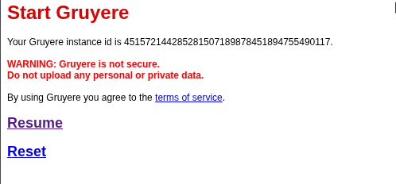

### Angreifer-Verteidiger Startseite

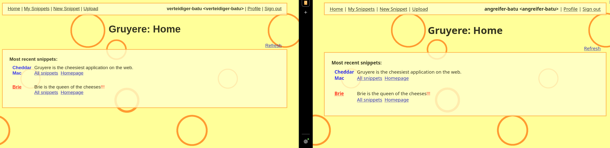

---

## B) Stored XSS in Gruyere

## B2 - DOM-Manipulation als Proof of Conecept
### Roter Hintergrund - Angreifer und Verteidiger

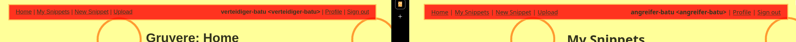

### Schriftliche Antwort auf vier Fragen

1. Warum konnte dieser Payload die Sicherheitsprüfung des Browsers umgehen, obwohl `<script>` blockiert wird?
	- Weil der Code sich nicht in einem `<script>`Tag befindet. Der Payload befindet sich innerhalb eines `` Elements, welche eine `onerror` Attribut hat und das ausführen von JavaScript Code erlaubt.
2. Was bedeutet es für die Sicherheit, dass der Payload auch im Browser des Verteidigers ausgeführt wird?
	- Schadcode wird einmalig gespeichert (in einer Daten dem Snippet-Eintrag) und dann bei jedem Seitenaufruf von jedem Nutzer ausgeführt. Im schlimmsten können Cookies abgegriffen werden.
3. Welche OWASP Top 10 Kategorie (2025) beschreibt Stored XSS? Nennen Sie Nummer und Bezeichnung.
	- **A03:2021 - Injection**
4. Was hätte die Applikation tun müssen, damit dieser Payload harmlos bleibt? (Stichwort: Output Encoding)
	- Die Applikation muss jede Benutzereingabe vor der Ausgabe in HTML enkodieren. Sonderzeichen sollten in HTML-Entitäten umgewandelt werden, sodass der Browser sie als Text darstellt und nicht als ausführbahrer Code.

---

## B2 - Cookies: Was sie sind und warum sie gefährlich sind

Cookies sind Datenpakete, die der Browser für eine Webseite speichert.

### Screenshot der DevTools mit sichtbarem Cookie-Wert

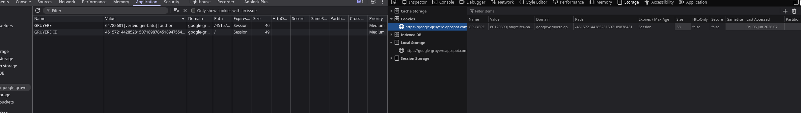

### Screenshot des roten Kastens im Fenster des Angreifers (eigenes Cookie)


Cookies des Angreifers.

### Screenshot des roten Kastens im Fenster des Verteidigers (Cookie des Verteidigers)


Cookies des Verteidigers.

### Schriftliche Antworten auf die drei Fragen

1. Was kann ein Angreifer tun, wenn er den Session-Cookie eines anderen Benutzers kennt?
	- Die Identität des Opfers ist bekannt und ein Angreifer kann diese übernehmen - **Session Hijacking**.
2. Was bewirkt das `HttpOnly`-Flag bei einem Cookie und wie schützt es vor diesem Angriff?
	- Ein Attribut, das beim Setzen eines Cookies mitgegeben wird:
		- `document.cookie` wird nicht zurückgegeben.
		- JavaScript kann den Cookie nicht lesen.
		- XSS-Payload sieht den Cookie gar nicht.
	- Der Browser sendet den Cookie weiterhin bei jedem HTTP-Request an den Sever - aber JavaScript hat keinen Zugriff darauf.
3. Warum ist es gefährlich, Session-Cookies im `localStorage` statt in einem `HttpOnly`-Cookie zu speichern?
	- `localStorafe`ist vollständig über JavaScript zugänglich - keine Flag kann es vor XSS schützen.

---

## B3 - Session-Hijacking: Cookie-Exfiltration zum Angreifer-Server

### Screenshot von SSH-Terminal 1 (Python-Server) mit der eingehenden GET-Anfrage (Cookie sichtbar)

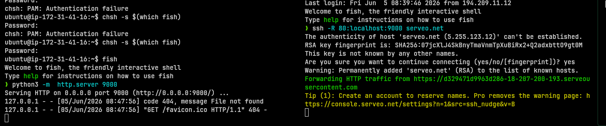

### Screenshot von SSH-Terminal 2 (Serveo) mit der zugewiesenen HTTPS-URL

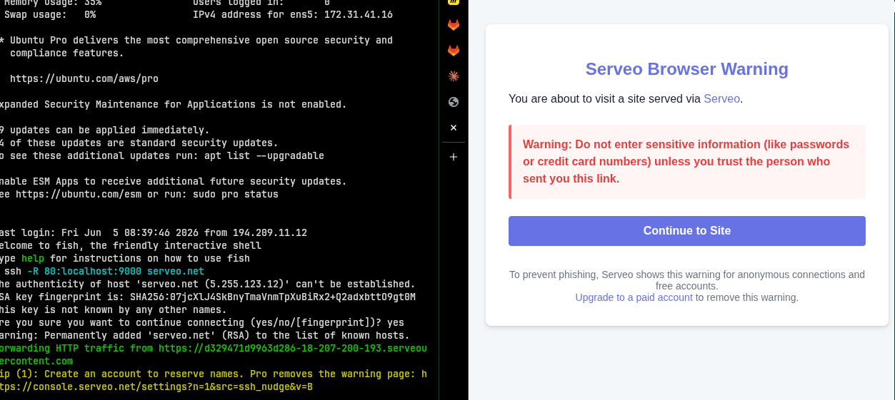

### Screenshot des Gruyere-Fensters des Angreifers **nach** der Cookie-Übernahme, mit dem Benutzernamen des Verteidigers sichtbar

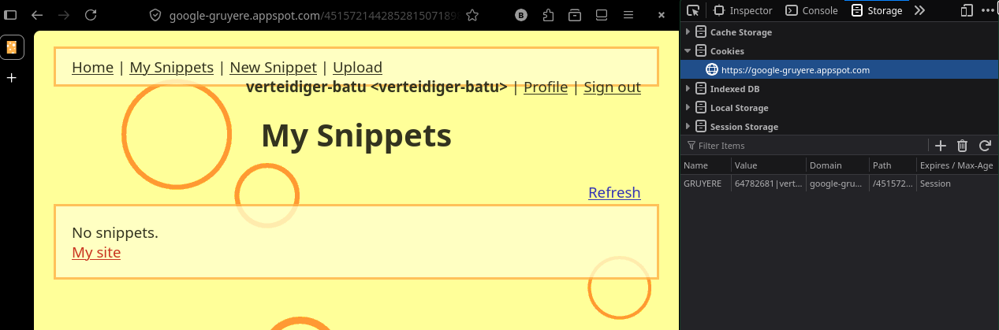

### Schriftliche Antworten auf die fünf Fragen

1. Warum konnte der Angreifer den Cookie des Verteidigers erhalten, ohne je dessen Passwort zu kennen oder Zugriff auf dessen Browser zu haben?
	- Das ist das Hauptelement von **Stored XSS**: Der Angreifer speichert Code in der Datenbank - der Browser des Opfers führt ihn aus. Standardmässige Authentifizierung verläuft durch einen einzigartigen Session Token, ist dieser einem Angreifer kann er sich durch diesen Token ein Identität von anderen übernehmen.
2. Welche Rolle spielt der `new Image().src`-Trick – warum funktioniert diese Technik trotz Same-Origin-Policy?
	- **Same-Origin-Policy** blockiert das Lesen JavaScript von fremden Domains. Sie blockert aber **nicht das Senden von Requests**.
3. Warum war der Serveo-Tunnel notwendig – was wäre passiert, wenn der Payload direkt `http://<EC2-IP>:9000` verwendet hätte?
4. Nennen Sie mindestens zwei technische Massnahmen, mit denen die Webapplikation diesen Angriff verhindert hätte.
5. Was bewirkt das `Secure`-Flag bei einem Cookie, und in welcher Situation schützt es?

---

## C) Reflected XSS in Gruyere

### 1. Reflexion finden

**UUID**: `451572144285281507189878451894755490117`

Seiten mit URL Parameter

https://google-gruyere.appspot.com/451572144285281507189878451894755490117/login?uid=angreifer-batu&pw=----

| Seite                                                                                                                  | Parameter | Wert                             |
| ---------------------------------------------------------------------------------------------------------------------- | --------- | -------------------------------- |
| Login                                                                                                                  | uid<br>pw | Account Name<br>Account Passwort |
| Snippets Refresh                                                                                                       | uid       | Account Name                     |
| Update Profile                                                                                                         | c<br>     |                                  |
| https://google-gruyere.appspot.com/451572144285281507189878451894755490117/snippets.gtl?uid=%3Ch1%3EHELLOTEST%3C/h1%3E | uid       |                                  |

**URL mit `HELLOTEST:`**
https://google-gruyere.appspot.com/451572144285281507189878451894755490117/saveprofile?action=update&name=HELLOTEST=&pw=&icon=HELLOTEST&web_site=HELLOTEST&color=&private_snippet=HELLOTEST

**URL welche HTML nicht escaped:**
https://google-gruyere.appspot.com/451572144285281507189878451894755490117/snippets.gtl?uid=%3Ch1%3EHELLOTEST%3C/h1%3E

### 2. XSS-Payload einschleusen

https://google-gruyere.appspot.com/451572144285281507189878451894755490117/snippets.gtl?uid=

### Screenshot von DevTools -> Network -> Response mit dem Payload im HTML-Quelltext

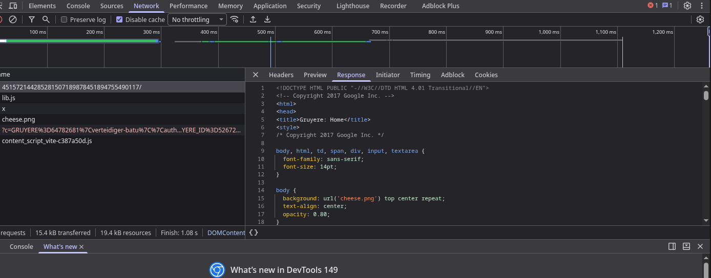

_Abbildung: Devtools, Netzwerk Response Login._

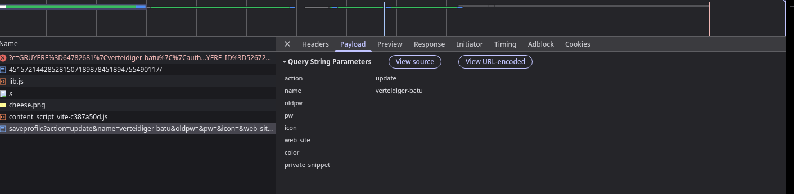

_Abbildung: Devtools, Update Profil._


### Screenshot des ausgeführten Alerts mit dem Payload sichtbar in der URL

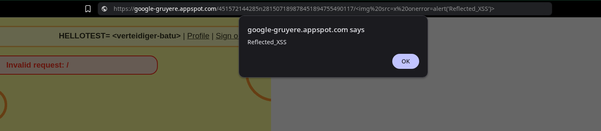

_Abbildung: Ausgeführter Alert durch URL eingeschleusten Code._


### Schriftiche Antworten auf die drei Fragen

1. Was ist der Hauptunterschied zwischen Stored XSS und Reflected XSS hinsichtlich Persistenz und Reichweite? (Antwort aus Schritt 3 ableiten)
	- Bei **Reflected XSS** wird der bösartige Code nicht dauerhaft auf dem Server gespeichert. Der Code wird ausgeführt, wenn er Teil der Anfrage ist.
2. Wie würde ein Angreifer in der Praxis vorgehen, um das Opfer dazu zu bringen, den manipulierten Link zu öffnen? (Social Engineering)
	- **Phishing-E-Mails / Messenger-Nachrichten**
	- **Vortäuschen von Dringlichkeit oder Angst**: Durch Nachrichten wie "Konto wird in 24 Studen gelöscht" werden Opfer unter Druck gesetzt und übersehen Warnsignale.
	- **Verschleierung des Links:** Damit Code nicht sofort auffällt, nutzen Angreifer **URL-Shortener**, **URL-Encoding** oder **Typosquatting** (Domains, die echten Webseiten ähnlich sind).
3. Welcher OWASP Proactive Control schützt am direktesten gegen XSS? Nennen Sie ihn mit Nummer und Titel. (Referenz: [owasp.org/www-project-proactive-controls](https://owasp.org/www-project-proactive-controls/))
- **C3: Validate all Input & Handle Excepetions**: Eingaben sollen validiert werden und Ausnahmen korrekt behandelt werden um sichre Ausgabe im Browser zu gewährleisten.

---

## D) Client-State Manipulation in Gruyere

### Abgabe

#### Screenshot der DevTools mit sichtbarem Cookie-Inhalt (vor der Manipulation).

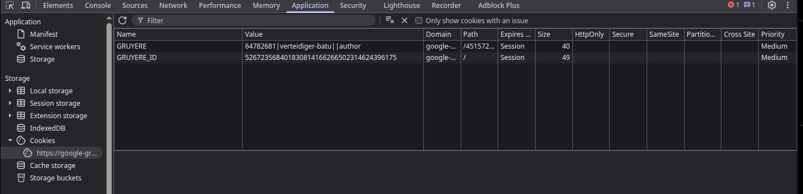

_Abbildung: Cookies vor der Manipulation._

#### Screenshot der Applikation nach erfolgreicher Manipulation (erhöhte Rechte sichtbar).

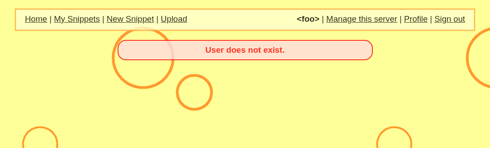

#### Schriftliche Antworten auf die drei Fragen.

1. Warum ist es gefährlich, sicherheitsrelevante Daten (wie Rollen oder Berechtigungen) im Client (Cookie/LocalStorage) zu speichern?
	- **Manipulierbarkeit:** Daten im `LocalStorage` können von Benutzer (Angreifer) über die Entwickler gelesen und mühelos geändert werden.
	- **XSS:** Durch Cross-Site Scripting Angriffe können diese Daten gestohlen werden und Angreifer können sich als andere Benutzer oder Privilegien esklaieren. 
2. Wo sollten Berechtigungsprüfungen stattfinden – im Client oder auf dem Server? Begründen Sie.
	- Sollte zwingend auf dem **Sever** stattfinden. Sie hält die alleinige **Source of Truth** und kontrolliert den Zugriff auf die Datenbank, APIs und Geschäftslogik
3. Welche OWASP Top 10 Kategorie (2025) beschreibt dieses Problem?
	- **A01:2025 - Broken Access Control:** Steht auf Platz 1. Beschreibt Szenarien, bei denen die Zugriffskontrolle nicht ordnungsgemäss durchgesetzt wird.