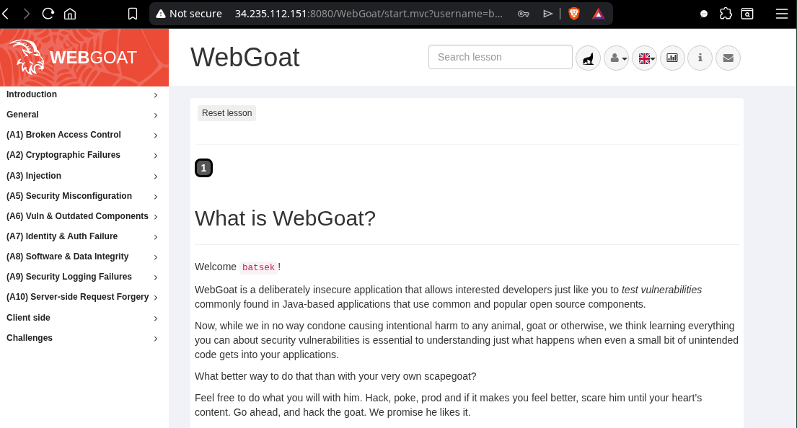
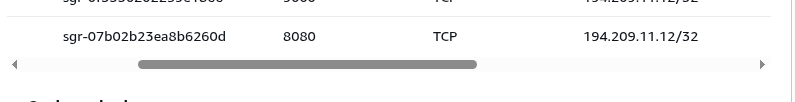

# readme.md

## A) WebGoat starten

### Abgabe

####  Screenshot der WebGoat-Startseite mit sichtbarer EC2-IP in der URL

_Abbildung1: WebGoat Webseite von der EC2 Instanz._

####  Screenshot der Inbound Rule für Port 8080

_Abbildung 2: Inbound Rule für Port 8080._

---

## B) SQL Injection

### Abgabe
#### Screenshot der gelösten B1-Aufgabe (grüne Bestätigung sichtbar) mit dem verwendeten Payload.
#### Screenshot der gelösten B2-Aufgabe mit dem Payload und den extrahierten Daten.
#### Schriftliche Antworten auf die vier Fragen.