# readme.md

## A) WebGoat starten

### Abgabe

####  Screenshot der WebGoat-Startseite mit sichtbarer EC2-IP in der URL


_Abbildung1: WebGoat Webseite von der EC2 Instanz._

####  Screenshot der Inbound Rule für Port 8080


_Abbildung 2: Inbound Rule für Port 8080._

---

## B) SQL Injection

### Abgabe
#### Screenshot der gelösten B1-Aufgabe (grüne Bestätigung sichtbar) mit dem verwendeten Payload.

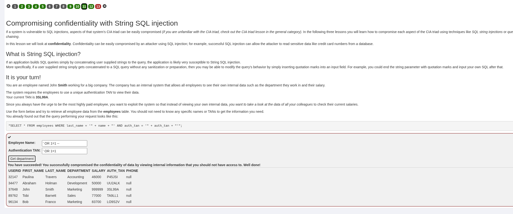
#### Screenshot der gelösten B2-Aufgabe mit dem Payload und den extrahierten Daten.

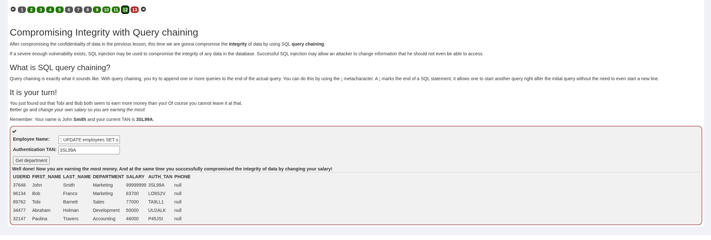


```sql
'; UPDATE employees SET salary = 99999999 WHERE last_name = 'Smith'; --
```

#### Schriftliche Antworten auf die vier Fragen.

1. Zeichnen Sie auf, wie das SQL-Statement aus B1 **vor** und **nach** dem Einschleusen des Payloads aussieht. Erklären Sie, warum die Authentifizierung dadurch umgangen wird.
	- Vor dem Einschleusen des Payloads sieht das SQL Statement folgendermassen `SELECT * FROM employees WHERE last_name = '' OR 1=1 --' AND auth_tan = '...';`	
	- Nach dem Injizieren das Payloads sieh der Payload: `SELECT * FROM employees WHERE last_name = 'OR 1:1 --' AND auth_tan = 'OR 1:1';`
		- Die Authentifizierung wird umgangen, weil die logische Bedingung des `WHERE`-Filter manipuliert wurde. Durch das `OR 1=1` wird die gesamte Abfrage für jeden Datensatz "WAHR". Die Prüfung der `auth_tan` wird durch das Kommentar Zeichen `--` komplett ignoriert und Angreifer müssen keine gültige TAN angeben.
2. Wie funktionieren **Prepared Statements** (parameterisierte Abfragen) technisch? Warum kann SQL Injection damit nicht mehr funktionieren?
	- Bei einem Prepared Statement wird der Prozess der Abfrage in zwei strikt getrennte Schritte unterteilt:
		1. **Vorbereitung (Prepare):** Die Anwendung sendet den SQL-Befehl mit Platzhaltern (z. B. `?`) an die Datenbank:  
		    `SELECT * FROM employees WHERE last_name = ? AND auth_tan = ?;`  
	    2. Die Datenbank analysiert diesen Befehl, kompiliert ihn und erstellt einen **Ausführungsplan**, _bevor_ die Benutzerdaten überhaupt bekannt sind. Die Struktur des Befehls steht damit fest.
		3. **Bindung (Bind):** Die Anwendung sendet die Benutzerdaten separat an die Datenbank. Die Datenbank nimmt diese Daten und setzt sie in die vorgesehenen Platzhalter ein.
	- Da die Datenbank den Ausführungsplan bereits erstellt hat, bevor die Daten ankommen, kann der Benutzer-Input die Logik des Befehls nicht mehr verändern. Wenn ein Angreifer `' OR 1=1 --` eingibt, behandelt die Datenbank dies nicht als Teil des SQL-Befehls, sonder sucht buchstäblich nach einem Mitarbeiter.
3. Welche OWASP Top 10 Kategorie (2025) beschreibt SQL Injection? Nennen Sie Nummer und Bezeichnung.
	- SQL Injection fällt unter die Kategorie der Injektionen.
		- **Nummer:** **A03:2025**
		- **Bezeichnung:** **Injection**
4. Nennen Sie neben SQL Injection zwei weitere Injection-Varianten (z.B. OS Command Injection, LDAP Injection) und beschreiben Sie kurz, was dabei injiziert wird und wo die Gefahr liegt.

| Variante                 | Was wird injiziert?                                                     | Wo liegt die Gefahr?                                                                                                                                                                                 |
| :----------------------- | :---------------------------------------------------------------------- | :--------------------------------------------------------------------------------------------------------------------------------------------------------------------------------------------------- |
| **OS Command Injection** | Befehle des Betriebssystems (z. B. `; rm -rf /`, `& dir`, `\| whoami`). | Wenn eine Web-App Benutzereingaben nutzt, um Systembefehle auszuführen (z. B. ein Ping-Tool). Der Angreifer kann das gesamte Betriebssystem übernehmen, Dateien löschen oder Schadcode installieren. |
| **LDAP Injection**       | LDAP-Filter-Syntax (z. B. `_)(uid=_))(                                  | (uid=*`).                                                                                                                                                                                            |

---

## C) Cross-Site Scripting (XSS) 

**Drei XSS-Typen im Überblick:**

| Typ               | Mechanismus                                                                                  | Wen trifft es?                        |
| ----------------- | -------------------------------------------------------------------------------------------- | ------------------------------------- |
| **Reflected XSS** | Payload in URL; Server spiegelt ihn sofort zurück                                            | Nur wer den manipulierten Link öffnet |
| **Stored XSS**    | Payload in Datenbank gespeichert (z.B. Kommentar)                                            | Alle Benutzer, die die Seite laden    |
| **DOM-based XSS** | Payload wird clientseitig durch JavaScript in den DOM geschrieben – der Server sieht ihn nie | Nur wer den manipulierten Link öffnet |

### Abgabe

#### Screenshot des ausgelösten Alerts bei C1a (Reflected) mit dem Payload sichtbar im Eingabefeld oder Response

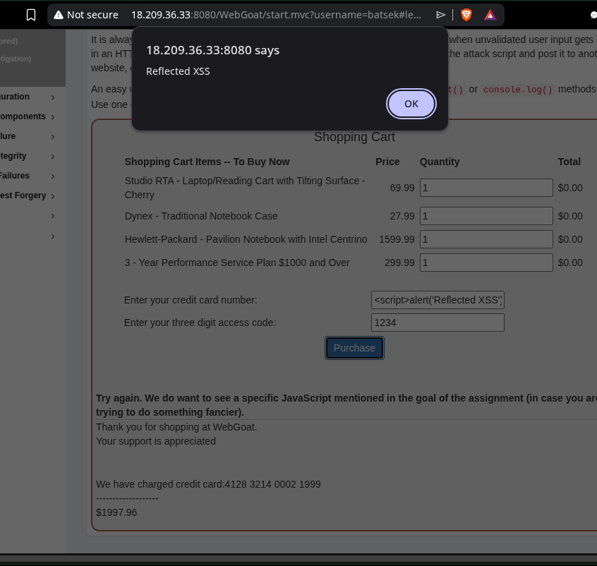

_Abbildung: Ausgelöster Alert in WebGoat._
#### Screenshot der gelösten WebGoat-Aufgabe C1a (grüne Bestätigung)

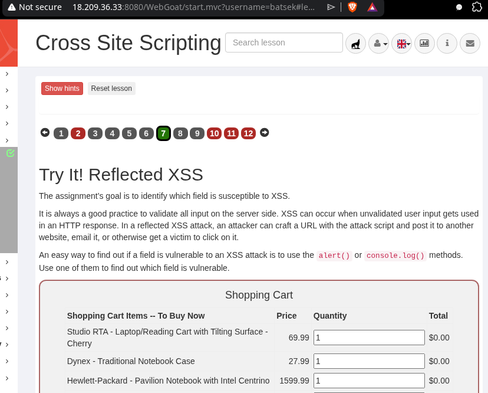

_Abbildung: Gelöste Aufgabe._
#### Screenshot der C1b-Analyse: welche Codezeile(n) Sie als verwundbar markiert haben

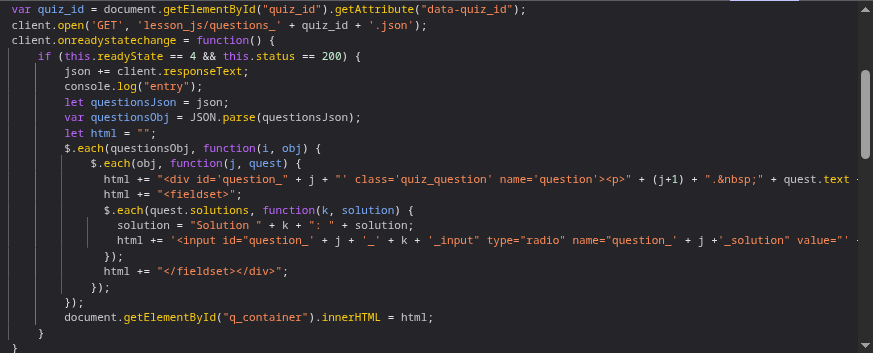

_Abbildung: Verwundbare Codezeilen._

#### Screenshot des ausgelösten Alerts bei C2 (Stored) nach dem Speichern des Kommentars

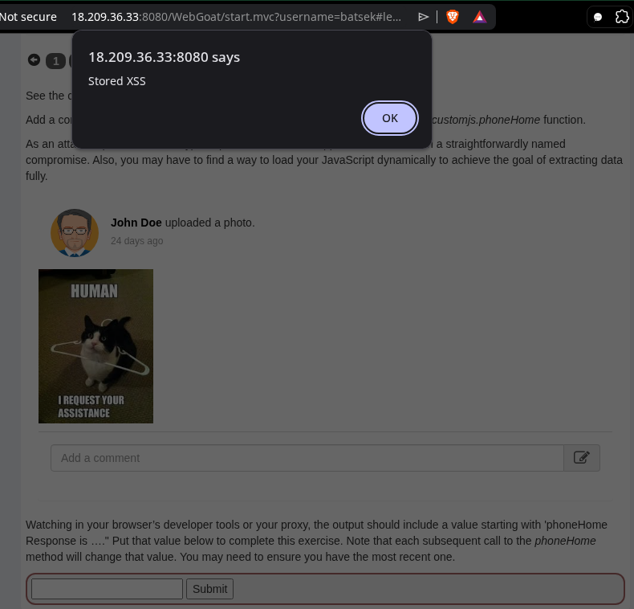

_Abbildung: Ausgelöster Alarm durch Benutzereingabe._
#### Screenshot der gelösten WebGoat-Aufgabe C2 (grüne Bestätigung)

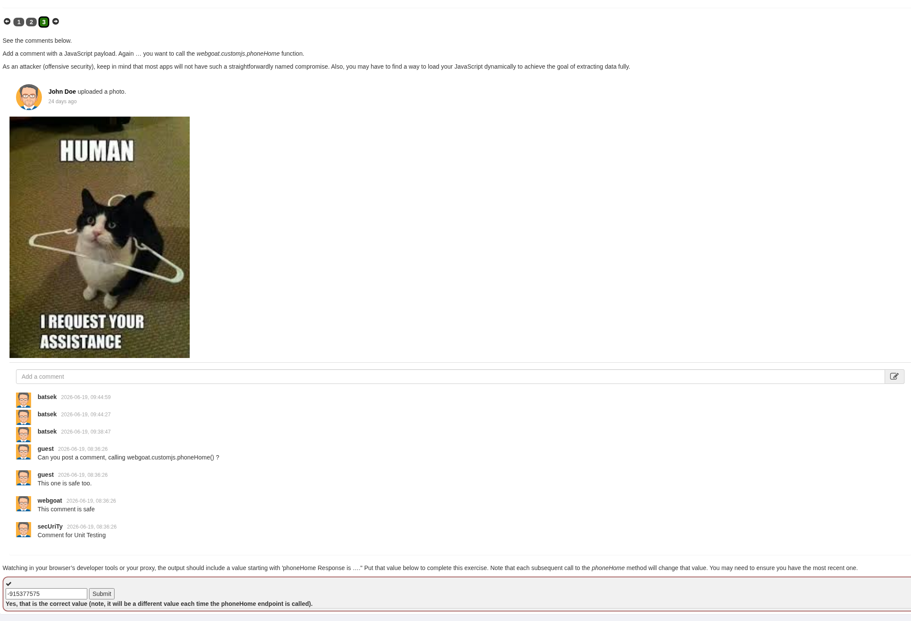

_Abbildung: Cross Site Scripting gelöste Aufgabe_
#### Schriftliche Antworten auf die fünf Fragen

1. Was ist der zentrale Unterschied zwischen Reflected XSS und Stored XSS hinsichtlich Persistenz und Reichweite?
	- **Persistenz:** Bei **Stored XSS** wird der bösartige Code dauerhaft auf dem Webserver gespeichert (z. B. in einer Datenbank oder einem Forum). Bei **Reflected XSS** findet keine Speicherung auf dem Server statt ; der Code ist direkt Teil einer manipulierten Anfrage und wird vom Server unmittelbar in der Antwort "reflektiert".
	- **Rechweite:** **Stored XSS** besitzt eine automatisierte und hohe Reichweite, da jeder normale Besucher der betroffenen Seite automatisch infiziert wird, ohne einen speziellen Link anklicken zu müssen. **Reflected XSS** ist hingegen stark zielgerichtet; ein Angreifer muss das Opfer aktiv mittels Social Engineering (z. B. Phishing) dazu bringen, eine speziell präparierte URL aufzurufen.
2. Was unterscheidet DOM-based XSS von Reflected XSS – warum ist DOM-based XSS für serverseitige Filter schwieriger zu erkennen?
	- Bei **Reflected XSS** wandert Schadcode zum Server und wird als HTML-Antwort zurückgeschickt. Bei **Dom-based XSS** findet die Injection vollständig auf der Client-Seite statt. JavaScript liest die Daten direkt aus einer lokalen Quelle aus schreibt sie eigenständig in das Dokument.
3. Was bedeutet **Output Encoding** und warum schützt es gegen XSS? Geben Sie ein konkretes Beispiel, wie `<script>` nach dem Encoding aussieht.
	- Output Encoding wandelt potenziell gefährlich Steuerzeichen in harmlose Textdarstellung um. Dadurch verliert der Browser die Fähigkeit, diese Zeichen als ausführbaren Programmcode zu interpretieren. Eingebettete Skripte werden stattdessen einfach als Text auf der Webseit angezeigt. 
4. Was ist der HTTP-Header `Content-Security-Policy` (CSP) und wie schränkt er XSS ein? (Recherchieren Sie falls nötig.)
	- Der _Content Security Policy_ ist ein Sicherheits-Header, den der Server an den Browser mitsendet. Er fungiert als eine Art "Erlaubnisliste" der Ressourcen, die die Webseite laden und ausführen darf.
	- Eine restriktive CSP schränkt Cross-Site Scripting massiv ein, indem sie standardmässig das Ausführen von direkt im HTML eingebettetem JavaScript-Code komplett verbietet. Zudem kann genau definiert werden, von welchem vertrauenswürdigen Domänen externe Skript-Dateien nachgeladen werden dürfen.
5. Welche OWASP Top 10 Kategorie (2021) beschreibt XSS? Nennen Sie Nummer und Bezeichnung.
	- In der Version der OWASP Top 10 wurde Cross-Site Scripting (XSS) als eigenständige Kategorie aufgelöst und der umfassenderen Risikokategorie für Injektionsfehler zugeordnet:
	- **A05:2021 – Injection**

---

## D) CSRF – Cross-Site Request Forgery

### Abgabe

#### Den Inhalt der `csrf-attack.html`-Datei (Screenshot oder Code-Block)

```html
<!DOCTYPE html>
<html>
<body>
  <h1>Herzlichen Glückwunsch! Sie haben gewonnen!</h1>
  <form id="csrfForm" action="http://18.209.36.33:8080/WebGoat/csrf/basic-get-flag" method="POST">
    <input type="hidden" name="csfr" value="false">
  </form>
  <script>
    document.getElementById('csrfForm').submit();
  </script>
</body>
</html>
```

#### Screenshot der analysierten Netzwerk-Anfrage aus DevTools (URL, Methode und Parameter sichtbar)

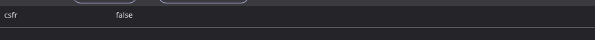

_Abbildung: Payload der Anfrage_


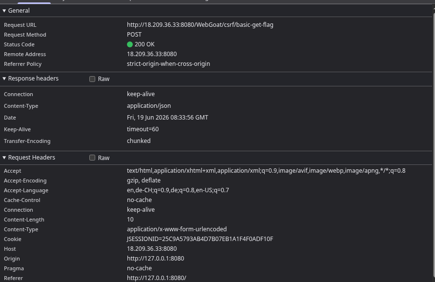

_Abbildung: Methode der Anfrage_

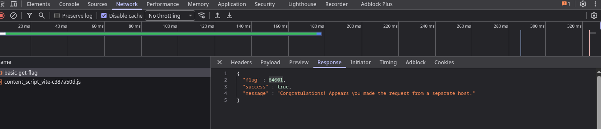

_Abbildung: Erfolgreicher POST Request_

#### Screenshot, der zeigt, dass der Angriff erfolgreich war (grüne WebGoat-Bestätigung)

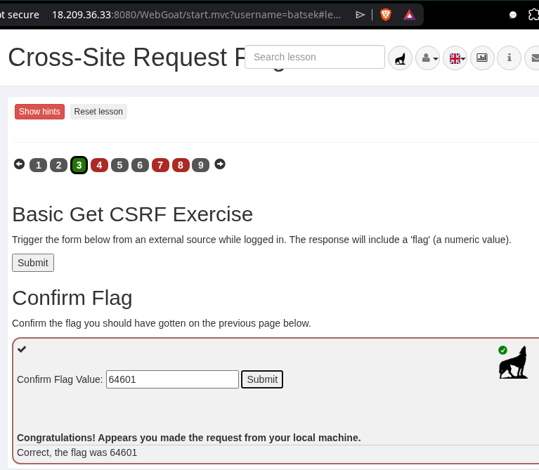

_Abbildung: Beweis der erfolgreicher Durchführung der Aufgabe_

#### Schriftliche Antworten auf die vier Fragen

1. Warum schickt der Browser den Session-Cookie mit, wenn die Anfrage von `csrf-attack.html` (einer lokalen Datei) kommt – obwohl das Opfer diese Seite nie bewusst besucht hat?
	- Der Browser schickt das Session-Cookie mit, weil dies das standardmässige Kernverhalten von HTTP-Cookies ist. Cookies sind and die Ziel-Domain (Origin) gebunden, nicht an die Quelle der Anfrage. Wenn eine Anfrage auf eine Ziel-Webseite ausgelöst wird, sieht der Browser nur, dass ein Request and die Ziel Seite gesendet werden soll. Wenn ein gültiges Session Cookie für diese Seite hinterlegt ist, wird diese mitgesendet.
2. Was ist ein **CSRF-Token** und warum kann eine Angreifer-Seite ihn nicht einfach aus dem Formular lesen?
	- Ein CSFR-Token ist ein kryptografisch sicherer, zufälliger und einzigartiger Wert, den der Server für die aktuelle Sitzung oder das jeweilige Formular generiert. Dieses Token wird serverseitig in ein verstecktes Fromularfeld eingebettet. Wenn das Formular abgeschickt wird, vergleicht der Server das mitgesendete Token mit dem in der Session gespeicherten Werd. Stimmen sie nicht überein, wird die Aktion blockiert.
3. Was bewirkt das `SameSite=Strict`-Flag bei einem Cookie und wie schützt es vor CSRF?
	- Das Cookie-Attribut `SameSite=Strict` weist den Browser an, das Cookie unter keinen Umständen mitzusenden, wenn es sich um eine domänenübergreifende Anfrage handelt.
	 - Ein Browser kann erkennen, dass Anfragen von einer anderen Seite stammt. Mit der Flag aktiv, blockiert der Browser das automatische Mitsenden des Cookies.
4. Welche OWASP Top 10 Kategorie (2025) beschreibt CSRF am ehesten? Nennen Sie Nummer und Bezeichnung.
	- In der aktuellen Struktur der OWASP Top 10 (Stand 2021 und fortgeführt in den Entwürfen für 2025) ist CSRF keine eigenständige Kategorie mehr, da es durch moderne Browser-Schutzmechanismen (wie standardmäßiges SameSite) seltener geworden ist. Es wird der folgenden Kategorie zugeordnet:
	- **A01:2025 – Broken Access Control** (Fehler in der Zugriffskontrolle)
	- **Begründung:** Da CSRF es einem Angreifer erlaubt, Funktionen im Kontext eines anderen Benutzers unautorisiert auszuführen, handelt es sich fundamental um eine Umgehung bzw. ein Versagen der Zugriffskontrollmechanismen der Applikation.

---

## E) Broken Access Control – IDOR

### Abgabe

#### Screenshot des gelesenen fremden Profils mit sichtbarer Profil-ID in der URL oder im Response

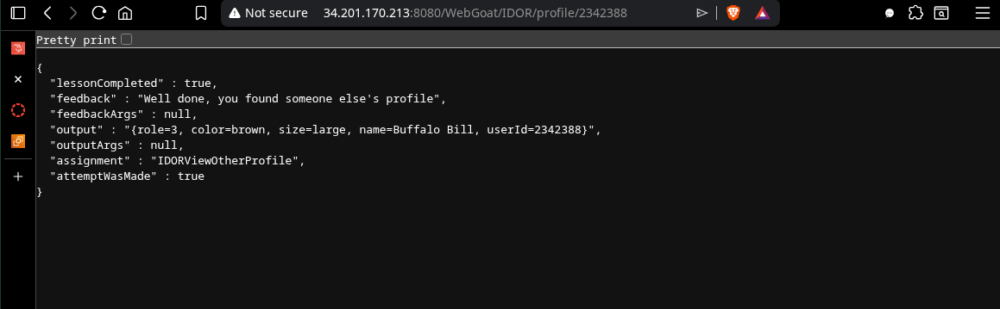

_Abbildung: Screenshot des gelesenes fremden Profils

#### Screenshot oder Command der erfolgreichen Veränderung (WebGoat-Bestätigung sichtbar)

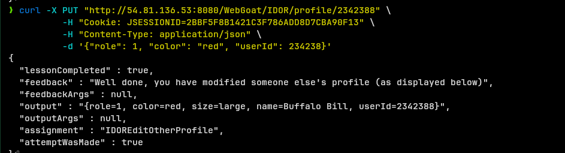

_Abbildung: Screenshot des Curl Command zu Änderung eines Profiles_

#### Schriftliche Antworten auf die vier Fragen

1. Warum reicht es nicht, eine Ressource einfach «nicht zu verlinken», um sie zu schützen? (Stichwort: Security through Obscurity)
	- Das blosse Verstecken oder Nicht-Verlinken einer Webseite oder Datei bietet keinen echten Schutz, da es auf de Prinzip "**Security through Obscurity**" basiert.
	- URLs folgen oft logischen Mustern. Angreifer oder automatisierte Scanner können diese Pfade leicht erraten.
	- Suchmaschinen-Crawler, Bowser-Historien, Server-Logfiles oder Referrer-Heaser können die vermeintlich geheime URL unbemerkt offenlegen.
2. Wie hätte die Applikation den IDOR-Angriff verhindern können? Beschreiben Sie die notwendige serverseitige Prüfung.
	- Der Server soll die Identität des aktuell angemeldeten Benutzer sicher über die serverseitige Session ermitteln.
	- Bevor der Server die angeforderte Ressource aus der Datenbank lädt, prüft or, ob der Eigentümer dieses Datensatzes mit der ID des aktuell angemeldeten Benutzers übereinstimmt.
3. Was ist der Unterschied zwischen **horizontaler** und **vertikaler** Privilegienerweiterung? Welche Form zeigt dieses IDOR-Beispiel?
	- **Horizontale Privilegienerweiterung (Horizontal Privilege Escalation):** Ein Angreifer greift auf Ressourcen oder Daten eines anderen Benutzers zu, der sich **auf derselben Hierarchie- oder Berechtigungsebene** befindet (z. B. Benutzer A liest die privaten Nachrichten oder Rechnungen von Benutzer B).
	- **Vertikale Privilegienerweiterung (Vertical Privilege Escalation):** Ein Angreifer erlangt Zugriff auf Funktionen oder Daten einer **höheren Berechtigungsebene** (z. B. ein regulärer Benutzer erlangt administrative Rechte und kann Konten löschen).
4. Welche OWASP Top 10 Kategorie (2025) beschreibt Broken Access Control? Nennen Sie Nummer und Bezeichnung und erklären Sie, warum sie auf Platz 1 steht.
	**Nummer und Bezeichnung (Stand 2025):** `A01:2025 – Broken Access Control` (Fehler in der Zugriffskontrolle).
	- Broken Access Control belegt den Spitzenplatz in den OWASP Top 10, weil sie das in Webanwendungen am häufigsten vorkommende und potenziell gefährlichste Sicherheitsrisiko darstellt. Bei den statistischen Auswertungen von OWASP wiesen die meisten untersuchten Anwendungen irgendeine Form von fehlerhafter Zugriffskontrolle auf (hohe Inzidenz).

---

## F) Broken Authentication – JWT Tokens (18%)

### Abgabe

#### Screenshot von jwt.io mit dem analysierten Original-Token (Payload sichtbar, Algorithmus sichtbar)

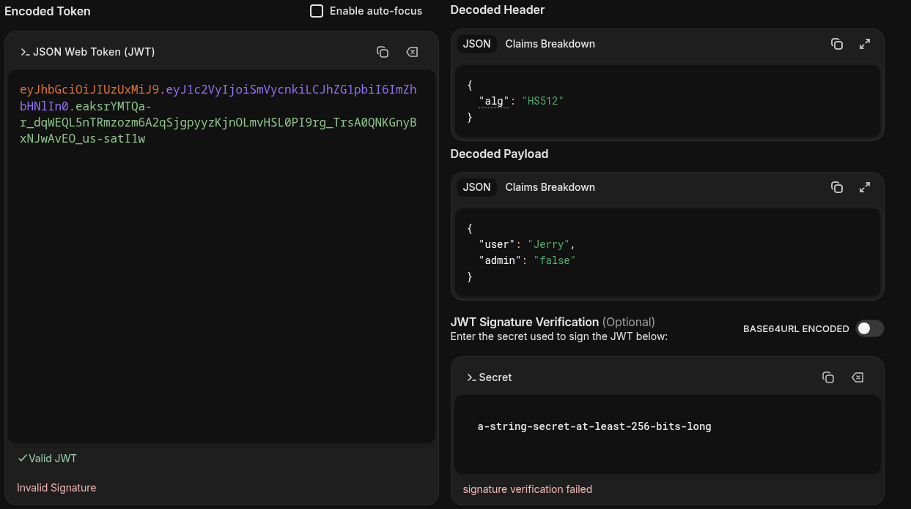

_Abbildung: Dekodierter JWT Token auf [jwt.io](jwt.io).  

#### Den vollständigen manipulierten Token (als Text oder Screenshot)

```
eyJhbGciOiJub25lIiwidHlwIjoiSldUIn0.eyJpYXQiOjE3ODMwODA2NTUsImFkbWluIjoidHJ1ZSIsInVzZXIiOiJTeWx2ZXN0ZXIifQ.
```

Curl Befehl:
```shell
curl -X POST "http://54.81.136.53:8080/WebGoat/JWT/votings" \
    -H "Cookie: JSESSIONID=09D56C1E88958FF2C9253DB97C7432A2" \
    -H "Cookie: access_token=eyJhbGciOiJub25lIiwidHlwIjoiSldUIn0.eyJpYXQiOjE3ODMwODA2NTUsImFkbWluIjoidHJ1ZSIsInVzZXIiOiJTeWx2ZXN0ZXIifQ.; JSESSIONID=09D56C1E88958FF2C9253DB97C7432A2 " \
    -H "Content-Type: application/json" -I
```


#### Screenshot der grünen Bestätigung in WebGoat nach dem erfolgreichen Angriff

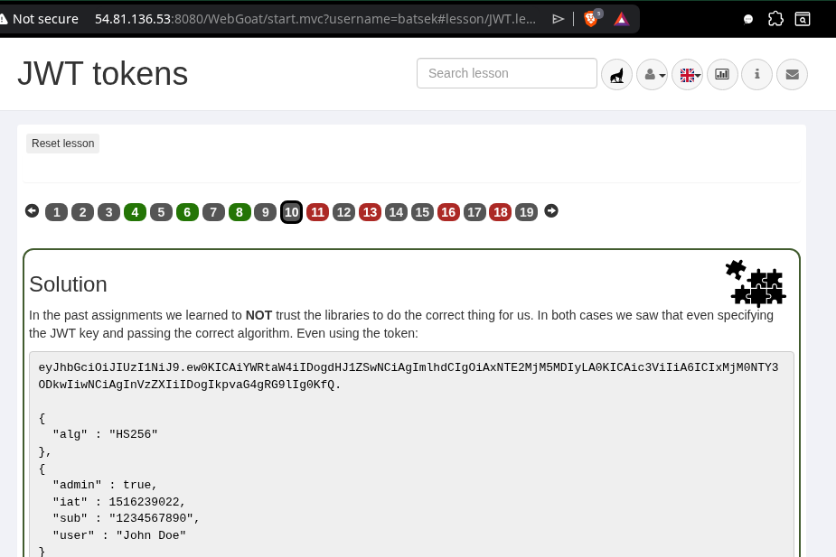

_Abbildung: Bestätigung der gelösten Aufgaben._

#### Schriftliche Antworten auf die vier Fragen

1. Warum ist es ein Sicherheitsproblem, wenn ein Server `"alg":"none"` akzeptiert?
	- Wenn ein Server `"alg":"none"` im JWT-Header akzeptiert, bedeutet das, dass er Token **digitale Signatur** als gültig einstuft.
2. JWT-Payloads sind nur Base64url-kodiert, nicht verschlüsselt. Was bedeutet das für den Umgang mit sensiblen Daten im Token?
	- Da der Payload mit JWT standardmässig lediglich mit Base64url-kodiert (also ein lesbares Textformat) und **nicht verschlüsselt** ist, kann jeder, der das Token abfängt oder Zugriff darauf hat, die darin enthaltenen Daten im Klartext auslesen.
3. Welche Massnahmen schützen gegen JWT-Angriffe? Nennen Sie mindestens drei (z.B. Algorithmus-Whitelist, kurze Ablaufzeiten, serverseitige Signaturprüfung).
	- **Strikte Algorithmus-Whitelist**: Der Server sollte explizit vorgeben, welche Algorithmen erlaubt (z.B. nur `HS256` oder `RS256`). Der Wert `none` muss serverseitig rigoros blockiert werden.
	- **Konsequente serverseitige Signaturprüfung**: Jedes eingehende Token muss zwingend vor der Verarbeitung des Payloads gegen den geheimen Schlüssel (Secret) oder den öffentlichen Schlüssel (Public Key) des Servers validiert werden.
	- **Kurze Ablaufzeiten (Expiration Time)**: Tokens sollten über das `exp`-Claim mit einer kurzen Lebensdauer versehen werden, um das Zeitfenster für den Missbrauch eines gestohlenen Tokens zu minimieren. Ergänzend können Refresh-Tokens genutzt werden.
4. Welche OWASP Top 10 Kategorie (2021) beschreibt Broken Authentication? Nennen Sie Nummer und Bezeichnung.
	- In der Version der OWASP Top 10 (2021) wurde das frühere "Broken Authentication" umbenannt und erweitert:
		- **Nummer und Bezeichnung:** **A07:2021 – Identification and Authentication Failures**
