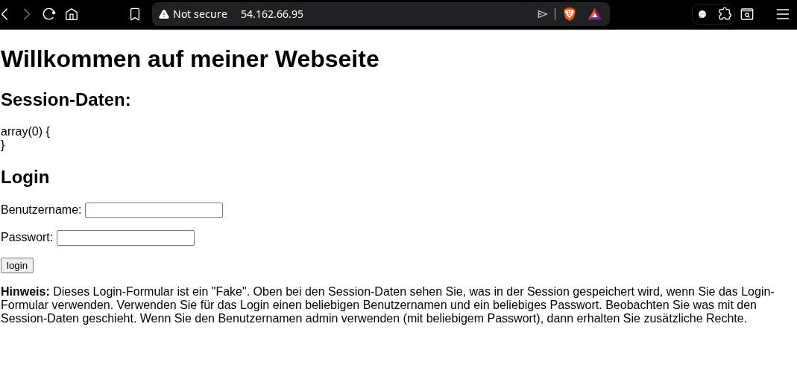
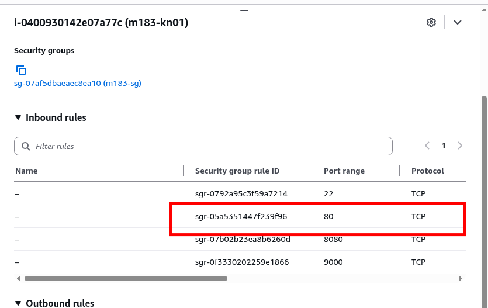
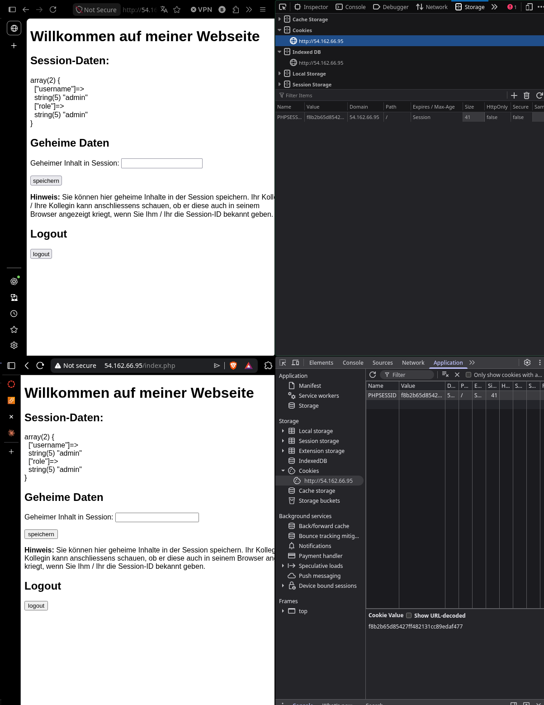

# readme

## A) Sicherheitsgruppe erweitern und App deployen

### Abgabe

#### Screenshot der laufenden App im Browser mit sichtbarer EC2-IP in der URL



_Abbildung: App Zugriff über Browser._
#### Screenshot der erweiterten Sicherheitsgruppe (Port 80 mit My IP sichtbar)



_Abbildung: Sicherheitsgruppe mit freigegebenem 80 Port._

---

## B) Sicherheitslücken in der App analysieren

## Abgabe

### Liste mit fünf identifizierten Sicherheitslücken inkl. Beschreibung und verletztem Schutzziel/OWASP-Kategorie.

#### 1. Kein Passwort-Check

**Problem:**

```php
if(isset($_POST['login'])) {
    $_SESSION['username'] = $_POST['username'];
    // ❌ Das Passwort wird NIEMALS geprüft!
    // Jeder Benutzername + beliebiges Passwort funktioniert.
}
```

Das `$_POST['login']`wird eingelesen, aber komplett ignoriert. Jeder kann sich als beliebiger Nutzer einloggen - inklusive `admin`.

**Schutzziel / OWASP:** Verletzt **Confidentiality (C)** - unbefugter Zugriff ist trivial möglich.
**OWASP:** `A07:2021 – Identification and Authentication Failures`

#### 2. Keine Sessions-ID-Erneuerung nach Login (Session Fixatioin)

**Problem:**

```php
if(isset($_POST['login'])) {
    $_SESSION['username'] = $_POST['username'];
    // ❌ session_regenerate_id() wird NIE aufgerufen!
    // Die Session-ID vor dem Login = die Session-ID nach dem Login
}
```

Ein Angreifer kann einem Opfer vorab eine bekannte Session-ID unterschieben (z.B. via URL). Wenn sich das Opfer einloggt, übernimmt der Angreifer mit dieser ID die Session. Dieses Angriffsszenario heisst **Session Fixation**.

**Schutzziel / OWASP:** Verletzt **Confidentiality (C)**  
**OWASP:** `A07:2021 – Identification and Authentication Failures`

#### 3 Unsichere Rollenvergabe (clientseitig manipulierbar)

_Zeile 14_
```php
if(isset($_POST['login'])) {
    $_SESSION['username'] = $_POST['username'];
    $_SESSION['role'] = 'user';

    if($_SESSION['username'] == 'admin') {
        $_SESSION['role'] = 'admin';
    }
}
```

Wer den Benutzernamen `admin` eingibt (ohne Passwortprüfung, siehe Lücke 1), erhält automatisch Admin-Rechte. Da kein Passwort geprüft wird, kann sich jeder zum Admin machen.

**Schutzziel / OWASP:** Verletzt **Integrity (I)** und **Confidentiality (C)**  
**OWASP:** `A01:2021 – Broken Access Control`

---

#### 4 Session-Cookie ohne Sicherheits-Flags

**Problem:**
Das PHP-Skript setzt keine sicheren Cookie-Flags. Die `PHPSESSID` wird standardmässig ohne Schutz übertragen:

|Flag|Fehlt?|Konsequenz|
|---|---|---|
|`HttpOnly`|❌|JavaScript kann den Cookie lesen → XSS-Angriff stiehlt die Session-ID|
|`Secure`|❌|Cookie wird auch über HTTP (unverschlüsselt) übertragen → Man-in-the-Middle möglich|
|`SameSite`|❌|Cookie wird bei Cross-Site-Requests mitgeschickt → CSRF möglich|

**Fix wäre:**
```php
session_set_cookie_params([
    'httponly' => true,   // Kein JS-Zugriff
    'secure'   => true,   // Nur HTTPS
    'samesite' => 'Strict' // Kein Cross-Site-Senden
]);
session_start();
```

**Schutzziel / OWASP:** Verletzt **Confidentiality (C)**  
**OWASP:** `A02:2021 – Cryptographic Failures` / `A07:2021 – Identification and Authentication Failures`

#### 5 Kein CSRF-Schutz

**Problem:**
```php
<!-- ❌ Kein CSRF-Token im Formular! -->
<form action="./index.php" method="post">
    <input type="text" name="message" />
    <input type="submit" name="speichern" value="speichern" />
</form>
```

Ein Angreifer kann eine externe Webseite erstellen, die im Hintergrund eine POST-Anfrage an `index.php` schickt. Da der Browser automatisch den Session-Cookie mitschickt, führt der Server die Aktion aus - ohne zu wissen, dass sie von einer fremden Seite ausgelöst wurde.

**Schutzziel / OWASP:** Verletzt **Integrity (I)** — Daten werden unerlaubt verändert  
**OWASP:** `A01:2021 – Broken Access Control` (CSRF ist unter Broken Access Control eingeordnet)

---

## C) Session-Fixation-Angriff demonstrieren

### Abgabe

#### Screenshot des zweiten Browsers nach Schritt 6 (Session-Daten sichtbar)



_Abbildung: Zwei verschiedene Browser mit derselben Session-Cookie._

#### Schriftliche Antworten auf die drei Fragen

1. Was ist passiert? Konnte der zweite Browser auf die Session des ersten zugreifen?
	- Der zweite sieht nach dem Neuladen **dieselben Session-Daten** wie der erste - also den eingeloggten Benutzernamen, die Rolle und allfällige gespeicherte Nachrichten. Das ist möglich, weil **beide Browser exakt dieselbe Session-ID** verwenden..
2. Warum ist das ein Sicherheitsproblem?
	- Ein Angreifer kann die **Identität des Opfers übernehmen**, ohne das Passwort zu kennen. Das nennt sich Session Fixation.
3. Welche eine Massnahme hätte diesen Angriff verhindert?
	- `session_regenerate_id(true)`direkt nach dem Login aufrufen. Nach dem Login erhält die Session eine **komplett neue, unvorhersehbare ID**. Die alte ID, die der Angreifer kannte, wird ungültig.

---

## D) Sicherheitslücken beheben

### Abgabe:

#### Video der DevTools mit gesetzten Cookie-Flags (`HttpOnly` und `Secure` sichtbar) für **vorher** (ohne Fix) und **nachher** (mit Fix)

**Vorher:**

![[2026-06-26_10-36-02.mp4]]

_Video: DevTools vor dem Fix._

**Nacher:**

![[2026-06-26_10-34-48.mp4]]

_Video: DevTools nach dem Fix._

#### Video der erfolgreichen Anmeldung nach Fix 2 (falsches Passwort muss abgelehnt werden)

![[2026-06-26_10-53-04.mp4]]

_Video: Login nach der Implementierung von Fix 2, einmal mit falschem Passwort und einmal mit dem richtigen Passwort._

#### Schriftliche Antworten auf die drei Fragen

1. Was bewirkt `HttpOnly` auf einem Cookie? Gegen welchen Angriff schützt dieses Flag?
	- Ein Cookie mit `HttpOnly` ist für JavaScript **nicht lesbar**. `document.cookie` gibt diesen Cookie nicht zurück. Schützt vor **XSS / Session-Hijacking**.
2. Was bewirkt `SameSite=Strict`? Gegen welchen Angriff schützt dieses Flag?
	- Der Browser sendet den Cookie **nur**, wenn die Anfrage von derselben Website stammt. Kommt die Anfrage von einer fremden Seite (Cross-Site), wird der Cookie nicht mitgeschickt.
3. Warum wurde `password_hash()` mit `PASSWORD_ARGON2ID` und nicht mit MD5 oder SHA-1 verwendet?
	- Das Problem liegt in der **Geschwindigkeit** - und das ist heir ein Nachteil, kein Vorteil. **MD5 / SHA-1** ist viel zu schnell und wurden für **Datenintegrität** entwickelt, nicht für Passwörter. Ein Angreifer kann mit einer einfachen Wortliste (`rockyou.txt`) alle MD5-Hashes in **Millisekunden** durchprobieren.

---

## E) MFA-Faktoren erklären

### Abgabe

#### Ausgefüllte Tabelle

| Kategorie    | Beschreibung           | Beispiel 1     | Beispiel 2          |
| ------------ | ---------------------- | -------------- | ------------------- |
| **Wissen**   | Etwas das Sie wissen   | Passwort       | PIN                 |
| **Besitz**   | Etwas das Sie besitzen | Smartphone     | Hardware-Token      |
| **Inhärenz** | Etwas das Sie sind     | Fingerabdruck  | Gesichterkennung    |
| **Ort**      | Wo Sie sich befinden   | Firmennetzwerk | Geografische Region |

#### Per Video Antworten auf die drei Fragen

1. Ist die Kombination «Passwort + PIN» echtes MFA? Begründen Sie.
	- **Nein**. Beide Faktoren gehören zu selben Kategorie: **Wissen**. Man kombiniert zwar zwei Dinge, aber nicht zwei _verschiedene_ Kategorien.
2. Ist die Kombination «Passwort + SMS-Code» echtes MFA? Begründen Sie.
	- **Ja**. Beide Faktoren stammen aus **verschiedenen Kategorien**.
3. AWS STS (Security Token Service) stellt temporäre Zugangsdaten aus. Welchem MFA-Prinzip ähnelt dieses Konzept am meisten, und warum? (Hinweis: Kapitel 2 Authentifizierung & Autorisierung → Temporäre Berechtigungen)
	- AWS STS stellt **temporäre Zugangsdaten** aus (Access Key + Secret + Session Token), die nach einer definierten Zeit automatisch ablaufen. Dieses Konzept ähnelt am meisten dem **Besitz-Faktor** kombiniert mit dem Prinzip der **temporären Berechtigungen** (Least Privilege). Temporäre Berechtigungen gelten nur für eine bestimmte Aktion oder Zeitspanne und werden danach automatisch entzogen. Der Token ist wie **physischer Schlüssel** - man muss ihn besitzen, er ist zeitlich begrenzt gültig, und man kann ihn nicht wiederverwenden.
